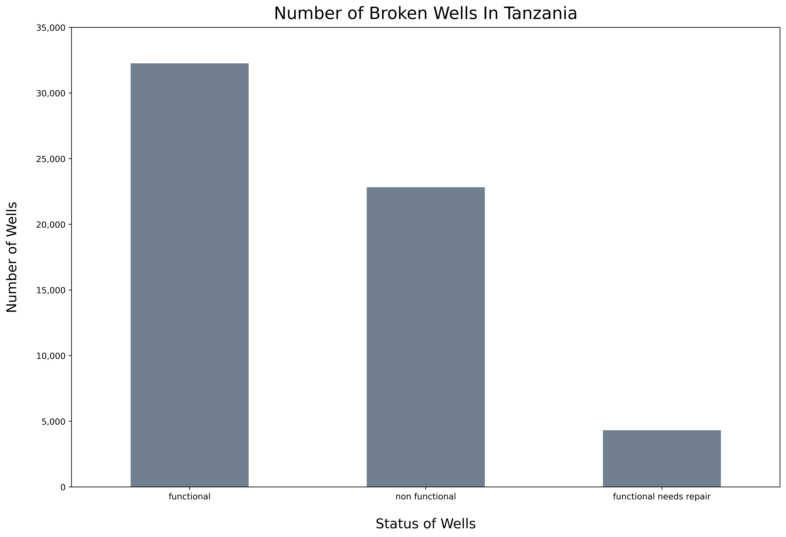

# Tanzania Water Wells (Classification Models)

**Author:**<br />
Jawwad A. Siddiqui<br />
Data Scientist<br />
https://github.com/jsiddiqui85<br />
https://www.linkedin.com/in/jsiddiqui85/<br />


# Overview

This project uses classification to model and predict the state of water wells in the African nation of Tanzania.  The purpose for the predictive model is to assist the goverment officials at 'The Tanzania Commission for Water' to find water wells that are 'not functioning at all' or that are 'functioning but require minor/major repairs' so the agency can sub-contract the work out to bring these water wells up to functioning level.  

I have used a curated data set found on 'DrivenData.com' to run my predictive models against.  Prior to cleaning the data, this dataset contained over 60k rows along with 30+ features.  


# Business Understanding
'The Tanzania Commission for Water' is a federal agency in the African State of Tanzania primarily responsible for the cleaniness and safety of the water that is supplied to the general public and residents of Tanzania.  

Currently, Tanzania lacks the ability to provide a safe source of drinking water to over '50%' of their population.  Although, there have been many attempts to correct this issue over the years, so far all of those attempts have fallen short of their objectives - leaving '45%' of their water wells in need of major repairs.  
My goal with this project is to help 'The Tanzania Commission for Water' and the director of this agency with identifying which wells need to be repaired currently, while also prediciting on which of these wells will need to be repaired in the future in order to maintain the cleanliness and safety of the water that is supplied to the Tanzania population.  


# Data
My model and recommendations come from work done on the 'Tanzanian Water Wells' data set found on 'Driven Data'.  From this dataset, I looked at various features that would best predict the water wells that need to be repaired.  My best model is able to predict with an '89% accuracy' to identify which water wells need to be repaired and this is what I have based my final recommendations off of.


# Methods
The target variable that I am making classification models to predict on is 'status_group'.  I created a new column named 'status_class' to transform the 'status_group' column into a classification variable, specifically creating a multi-class target that includes: 'non functional: 0', 'functional needs repair: 1', and 'functional: 2'.


# Review Current Status of Water Wells



The bar chart above shows the current status of the Tanzanian water wells.  

There are a total of '59,500 wells' - with '32,259' of the water wells that are fully functioning, among these include '22,824' of the wells that are completely non functioning, and '4,317' of total wells that need to be repaired to be considered functioning.


# Classification Models & Accuracy Scores

I determined that in order to predict which water wells will need to be repaired to be deemed functional in the future, that I would need to utilize how accurately my model is performing.  Therefore, I have resorted to using the accuracy score for all of the models explained below.

I took an iterative approach to model building, trying to improve on my previous model accuracy score with each iteration.  I also leveraged pipelines to reduce data leakage with each model.

1. **DummyClassifier:** this model was created to compare my accuracy scores 
- **Baseline Accuracy Score:** '.542'
2. **LogisticRegression:** this model was created using the default parameters simply to compare results for further modeling
- **Accuracy Score:** '.786'
3. **RandomForest:** an ensemble this model was created next because it outputs the class that is selected by the most trees, while correcting overfitting to the training set
- **Accuracy Score:** '.889'
4. **XGBoost:** this model was chosen due to its relative speed and performance when compared to the other models above - due to time constraints, this model was chosen to ensure I could meet the requirements of the project while delivering another accuracy score
- **Accuracy Score:** '.791'

# Final Model

For my final model, I created another pipeline using GridSearch to try and determine the best parameters for my RandomForest model above since it performed the best. Unfortunately, the best parameters that were suggested by the GridSearch did not improve my RandomForest model at all.  In fact, after running another RandomForest model with the new parameters, I received the same accuracy score as above of '.889'.

# Conclusions

I would like **The Tanzania Commission of Water** agency to focus on two main aspects when trying to determine which water wells will need to be repaired in order to maintain functionality and provide the Tanzanian residents with safe drinking water.  These two recommendations are to focus their efforts on water wells that are completely non-functional wells and also wells that are classified as functional but they require important repairs to remain functional.  By focus your efforts on these two classifications of wells, you can ensure that your country will remain on top of the health and safety issues regarding the water that is being distributed to their residents.

# Suggested Further Exploration

To further refine water well repair predictions, I am recomminding to look deeper into the regions where the water wells that need to be repaired are located.  In addition, I strongly recommend conducting a deeper dive into which specific parts of a particular water well need to be repaired so it can be considered functional again.


## Repository Structure
```
├── data
├── images
├── README.md
├── LICENSE
├── Tanzania Wells Presentation.pdf
└── Final_Tanzania_Wells_Notebook.ipynb
